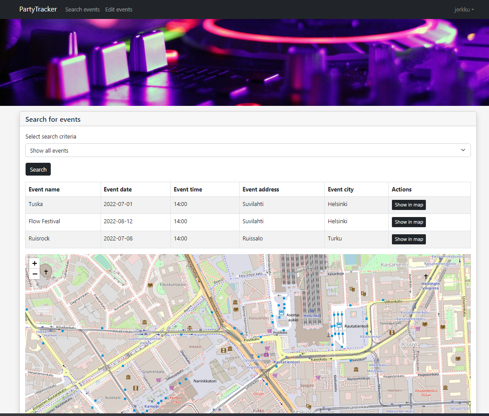

# PartyTracker
This is an app to see where all fun parties are. You can add, edit and delete events in your local database with this app.   
If you put coordinates when adding an event, you can also see where event is located in a map.   




# Database
App has a database called PARTYEVENTS, and two tables called PARTY and USERS. Columns are following:
```shell
CREATE TABLE party (
    id INT NOT NULL AUTO_INCREMENT,
    name VARCHAR(50) NOT NULL,
    date VARCHAR(50) NOT NULL,
    time VARCHAR(5) NOT NULL,
    address VARCHAR (50),
    city VARCHAR (25),
    x DOUBLE,
    y DOUBLE,
    PRIMARY KEY(id)
);

CREATE TABLE users (
    id INT NOT NULL AUTO_INCREMENT,
    username VARCHAR(50) NOT NULL,
    email VARCHAR(50) NOT NULL,
    password VARCHAR(150) NOT NULL,
    creation_time TIMESTAMP NOT NULL,
    role VARCHAR(25) NOT NULL,
    PRIMARY KEY(id)
);
```


# REST API
The database can be accessed by making REST requests.

### Retrieving events with GET methods
All the following methods will return data in JSON format.

```GET: localhost:8081/api/parties```   
Retrieves all fields from every event.

```GET: localhost:8081/api/parties/date```   
Retrieves all fields from events where the 'date'-field is within a specified range.   
Example: ```localhost:8081/api/parties/date?min=2021-01-01&max=2022-12-30```

```GET: localhost:8081/api/parties/city```   
Retrieves all fields from events where the 'city'-field matches the specified string.   
Example: ```localhost:8081/api/parties/city?city=helsinki```

### Adding events with POST method
```POST: localhost:8081/api/parties```   
The new event must be in JSON format, and it must include all fields in the PARTY-table except for id.   
Example: ```{"name": "Tuska", "date": "2022-07-01", "time": "14:00", "address": "Suvilahti", "city": "Helsinki",
"x": "60.166640739", "y": "24.943536799"}```

### Modifying events with PATCH method
```PATCH: localhost:8081/api/parties```   
Takes a JSON that must include the id of the event being modified and all fields in the PARTY-table (even if only some
of them will be changed).  
Example: ```{"id": "1", "name": "Tuska", "date": "2022-07-01", "time": "14:00", "address": "Suvilahti",
"city": "Helsinki", "x": "60.166640739", "y": "24.943536799"}```

### Deleting events with DELETE method
```DELETE: localhost:8081/api/parties```   
Takes a JSON that includes the id of the event being deleted.   
Example: ```{"id": "1"}```

### Register and login authentication
```POST: localhost:8081/api/register```   
Takes a JSON that includes the user's username, email and password. 
Checks if account already exists, if it doesn't exist, inserts it to the database.   
Example: ```{"username": "jerkku", "email":jerkku@gmail.com, "password": testi123 }```

```POST: localhost:8081/api/login```   
Takes a JSON that includes the user's username and password.
Checks that the information is, if it is, proceeds in application.   
Example: ```{"username": "jerkku", "password": testi123 }```

```POST: localhost:8081/logged_in```   
Takes token as an data. Consistently checks that token is valid    
Example: ```{"token": "ehQch4JMrXz....."}```

```POST: localhost:8081/protectedRoute```
Checks user's permissions
Example: ```{"role": "ROLE.ADMIN"}```


# Guide for setup
First, make sure you have node.js and npm installed globally.
Then proceed to next steps, which you can do in your code editors command line.
You will need either mariaDB or MySQL database for this.
### Setup for all dependencies
Please enter following commands to your editors command line:

```shell
npm init
npm install
npm install --save-dev nodemon
npm install concurrently --save-dev
```
### Setup for database
You will need to create a connection.js file into api folder. Insert following code to that file, with your own username and password.

```js
module.exports = {
    credentials: {
        host: "localhost",
        user: "YourUserName",
        password: "YourPassWord",
        database: "partyevents"
    }
}
```
In src/database.sql file you can find SQL queries that you can use to set up database and some base information.   


### Running the servers
You can run client side and server side with following commands:
```shell
npm start
nodemon src/server.js
```
